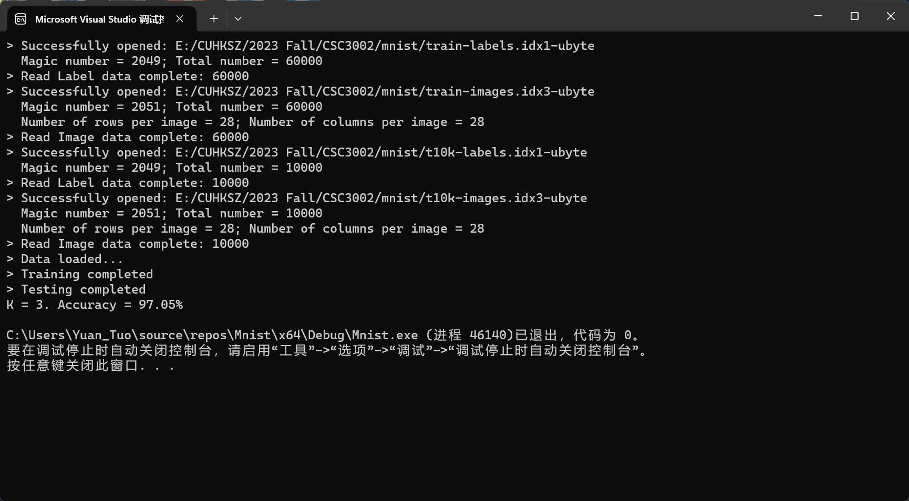
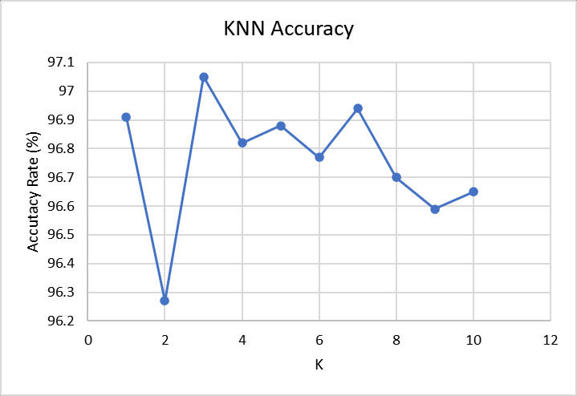
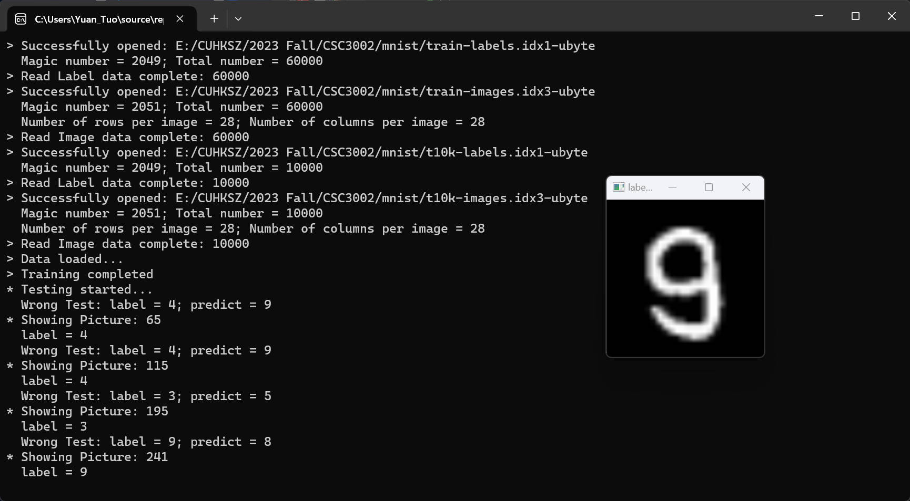

#  Handwritten Digit Recognition Project

## Background Information

Handwritten digit recognition is an important problem in computer vision and machine learning field. For example, this problems involves different machine learning algorithm and it has been applied in various situation: reading bank card number, ID card number, and digitizing documents.

## Project Detail

Code language: C++

IDE: Microsoft Visual Studio Community 2022

OpenCV version: 4.8.1 (latest)

Algorithm: KNN

Demo Screenshot:



## Usage

### Preperation

1. Download data from http://yann.lecun.com/exdb/mnist/. (backup: https://web.archive.org/web/20231128010337/http://yann.lecun.com/exdb/mnist/)
2. Uncompress 4 data into a directory.
3. Install Microsoft Visual Studio Community here: https://visualstudio.microsoft.com/vs/community/
4. Install OpenCV from: https://github.com/opencv/opencv/releases/tag/4.8.1
5. Configure OpenCV Path in system environment variable: add the path of OpenCV library directory (/path/to/opencv/build/x64/vc16/bin) to PATH.

### Config Visual Studio

1. Install C++ workload in Visual Studio.
2. Create a new project.
3. Right click on the project name in Solution Explorer, select Properties.
   1. In VC++ Directories, add the path of OpenCV include directory (/path/to/opencv/build/include) to Include Directories.
   2. In VC++ Directories, add the path of OpenCV library directory (/path/to/opencv/build/x64/vc16/lib) to Library Directories.
   3. In Linker > Input, add the name of OpenCV library (opencv_world481.lib) to Additional Dependencies.
4. Copy the code from main.cpp to your project.

### Set up data path

1. Open main.cpp.
2. Change the basePath of data in line 16. (e.g. "E:/CUHKSZ/2023 Fall/CSC3002/mnist/")
3. Config if you want to show the wrong-predicted image in line 13. Set true to pop up windows showing image. Default: false.
4. Config the number of testing images in line 14. Set 0 to test all images. Default: 0.

### Run

1. Click the green triangle button on the top of Visual Studio.
2. Wait for the result.

## Implementation

### Data

The data is from http://yann.lecun.com/exdb/mnist/. The data is in IDX format. The format is described in http://yann.lecun.com/exdb/mnist/. To read the data, I use the code from https://stackoverflow.com/questions/8286668/how-to-read-mnist-data-in-c.

In the code, I use file.read() to read the data from file. The data is stored in unsigned char. Then I use Mat::zeros() to init the Mat with zero. I use Mat::at() to set the value of Mat. 

For the label data, it is a 1D array (60000,1). For the image data, it is a 28x28 matrix, all data was then stored in a 1D array (60000,784).

Because the data in image range from 0 to 255, I normalize the data to range from 0 to 1 for better performance: https://stats.stackexchange.com/questions/287425/why-do-you-need-to-scale-data-in-knn

### KNN

KNN is a simple algorithm. And it is easy to implement. So I choose KNN as the algorithm for this project.

The basic idea of it is to find the nearest k neighbors of the test data, and then use the majority of the labels of the nearest neighbors to predict the label of the test data. The distance between two data is calculated by Euclidean distance.

In this project, I use OpenCV to implement KNN. The code shows steps:

- Use cv::ml::KNearest::create() to create a KNN object.
- Set the default k and set the object to be a classifier. (best default k tested in the following section is 3)
- Use cv::ml::TrainData::create() to create a train data object.
- Use knn->train() to train the model.

For the prediction and test part, code shows steps:

- Use knn->predict() to predict the label of test data.
- Convert the data type of prediction and test labels to CV_8UC1 for comparison.
- Compare the prediction and test labels to calculate the accuracy.
- If showWrongImg is true, show the wrong predicted image. (showImg() is a function to show the image)
- Return the accuracy.

### Showing Image

Code shows steps:

- Convert the data type of label to CV_8UC1 for display.
- Get the label of the image.
- Create a Mat with size 28x28.
- Copy the data of the image to the Mat.
- Resize the image to 200x200 for better display.
- Show the image with label as title.
- Wait for a keystroke in the window.

### Main Function

The main function shows steps:

- Read the training data and test data.
- Normalize the data.
- Train the model.
- Test the model.
- Show the accuracy.

If you want to test different k, you can uncomment the for loop and comment the `int k = 3;` line.
If you want to show the image, you can uncomment the `showImg(trainLabels, trainImages, 10);` line. (10 is the index of the image)

## Result

### Accuracy

The accuracy of different k is as below:
```
K = 1. Accuracy = 96.91%
K = 2. Accuracy = 96.27%
K = 3. Accuracy = 97.05%
K = 4. Accuracy = 96.82%
K = 5. Accuracy = 96.88%
K = 6. Accuracy = 96.77%
K = 7. Accuracy = 96.94%
K = 8. Accuracy = 96.7%
K = 9. Accuracy = 96.59%
K = 10. Accuracy = 96.65%
```

The best accuracy is 97.05% when k = 3.



### Wrong Predicted Image

Some wrong predicted images are as below:



## Summary

In this project, I use OpenCV to implement KNN algorithm for handwritten digit recognition. The accuracy is 97.05% when k = 3. The result is not bad.

One interesting thing is that, unlike other machine learning algorithm, KNN does not need to train the model. It just needs to store the training data. So the training time is very short. But the test time is very long. Because it needs to calculate the distance between the test data and all training data.

Also the model will not change after training or testing. So the accuracy will not change if k fixed.

This project can be still improved by using other machine learning algorithm.

## Reference

- http://yann.lecun.com/exdb/mnist/
- https://docs.opencv.org/4.8.0/
- https://stackoverflow.com/questions/8286668/how-to-read-mnist-data-in-c
- https://stats.stackexchange.com/questions/287425/why-do-you-need-to-scale-data-in-knn